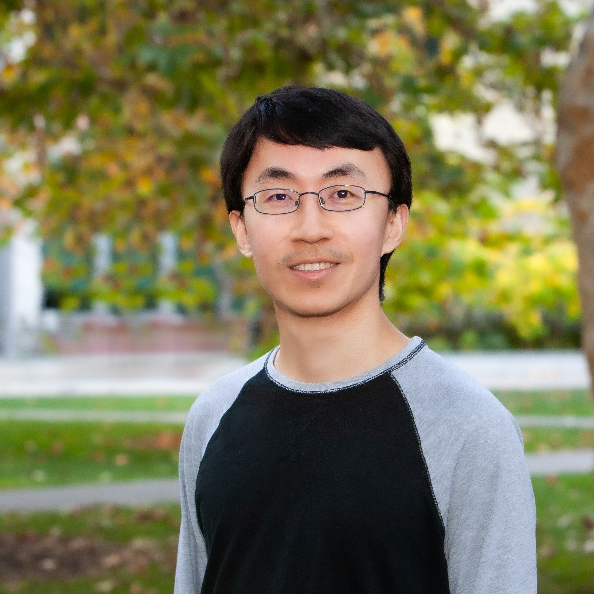

Associate Professor, [Department of Electrical and Computer Engineering](https://ece.ucsd.edu/)

Associate Adjunct Professor, [Division of Biomedical Informatics, Department of Medicine](https://dbmi.ucsd.edu/)

Affiliated Faculty, [Halıcıoğlu Data Science Institute in the School of Computing, Information and Data Sciences](https://datascience.ucsd.edu/), [Department of Molecular Biology in the School of Biological Sciences](https://biology.ucsd.edu/research/academic-departments/mb/index.html), 
[Shu Chien-Gene Lay Department of Bioengineering](https://be.ucsd.edu), [Skaggs School of Pharmacy and Pharmaceutical Sciences](https://pharmacy.ucsd.edu), [AI Group in the Department of Computer Science and Engineering](https://ai.ucsd.edu/), [Center for Machine-Intelligence, Computing and Security](https://mics.ucsd.edu/), [Institute of Engineering in Medicine](https://iem.ucsd.edu), and [Institute for Genomic Medicine](https://igm.ucsd.edu).

University of California San Diego

I obtained my PhD from the Machine Learning Department, School of Computer Science, Carnegie Mellon University.  My research  interests mainly lie in [machine learning inspired by humans' learning skills](https://openreview.net/attachment?id=e5qDTqs1MS&name=pdf) (especially classroom learning skills), such as [learning by self explanation](https://proceedings.neurips.cc/paper_files/paper/2022/hash/5e84e4413268b713f0d4a1b23a9dae57-Abstract-Conference.html), [small-group learning](https://openaccess.thecvf.com/content/CVPR2022/papers/Xie_Performance-Aware_Mutual_Knowledge_Distillation_for_Improving_Neural_Architecture_Search_CVPR_2022_paper.pdf), [learning by teaching](https://openreview.net/pdf?id=Tl8OmiibP99), etc., and their applications in **Large Language Models**, **Foundation Models**, **Healthcare**, and **Biomedicine**. [Here](research-summary.pdf) is a summary of research outcome. Some highlights: (1) Our [DreamPRM-1.5](https://github.com/coder-qicao/DreamPRM-1.5) and [DreamPRM-1.0](https://arxiv.org/abs/2505.20241) methods achieve first place on the [MMMU](https://mmmu-benchmark.github.io/#leaderboard) and [MathVista](https://mathvista.github.io/) leaderboards for multi-modal reasoning, surpassing GPT-5 and Gemini Pro 2.5; (2) our [GenSeg](https://www.nature.com/articles/s41467-025-61754-6) method is selected as [Nature Communications Editors’ Highlights](https://www.nature.com/collections/aahajfhafc) (“the 50 best papers recently published”); and (3) our [Betty](https://openreview.net/forum?id=LV_MeMS38Q9) framework was recognized as a Notable-Top-5% paper at ICLR 2023. I received an NSF Career Award in 2024 and an NIH MIRA Award in 2025.  

Email: p1xie@ucsd.edu [Twitter](https://x.com/cmuptx)

## I am looking for highly-motivated PhD students, postdocs, and master students to join my group. If you plan to apply to the PhD program in the CSE department and are interested in working with me, please email me. I am also looking for research interns.  

## News
* 2025/9. Two papers are accepted by NeurIPS 2025, including [DreamPRM](https://arxiv.org/abs/2505.20241).
* 2025/9. Our method [DreamPRM-1.5](https://github.com/coder-qicao/DreamPRM-1.5) for multi-modal LLM reasoning achieves first place on the [MMMU](https://mmmu-benchmark.github.io/#leaderboard) leaderboard!
* 2025/8. Our work - [Generative AI enables medical image segmentation in ultra low-data regimes](https://www.nature.com/articles/s41467-025-61754-6) is selected as [Nature Communications Editors’ Highlights](https://www.nature.com/collections/aahajfhafc) ("the 50 best papers recently published").
* 2025/8. Two papers are accepted by EMNLP 2025.
* 2025/7. Our work - [Generative AI enables medical image segmentation in ultra low-data regimes](https://www.nature.com/articles/s41467-025-61754-6) is featured in [UCSD News](https://today.ucsd.edu/story/new-ai-tool-learns-to-read-medical-images-with-far-less-data).
* 2025/7. Our work - [Generative AI enables medical image segmentation in ultra low-data regimes](https://www.nature.com/articles/s41467-025-61754-6) - is published in Nature Communications.
* 2025/7. Our work - [BiDoRA: Bi-level Optimization-Based Weight-Decomposed Low-Rank Adaptation](https://openreview.net/forum?id=v2xCm3VYl4) is accepted by Transactions on Machine Learning Research. 
* 2025/7. Co-organizing the [NeurIPS 2025 2nd Workshop on Multi-modal Large Language Models and Foundation Models for Life Sciences](https://nips2025fm4ls.github.io/).
* 2025/6. I am promoted to Associate Professor with tenure. Huge thanks to my students, colleagues, collaborators, and family!
* 2025/6. Our method [DreamPRM](https://arxiv.org/abs/2505.20241) for multi-modal LLM reasoning achieves first place on the [MathVista](https://mathvista.github.io/) leaderboard. 
* 2025/6. Our work on [Reweighting Pretraining Objectives for Task-Adaptive Pretraining](https://openreview.net/forum?id=DCCw2CEVFS&referrer=%5BAuthor%20Console%5D(%2Fgroup%3Fid%3DTMLR%2FAuthors%23your-submissions)) is accepted by Transactions on Machine Learning Research.
* 2025/3. Our work on [downstream task guided continual pretraining](https://arxiv.org/abs/2402.18128) is accepted by Transactions on Machine Learning Research. 
* 2025/3. Co-organizing the [ICML 2025 Workshop on Multi-modal Large Language Models and Foundation Models for Life Sciences](https://fm4ls.github.io/).
* 2025/1. Received an NIH Maximizing Investigators' Research Award (MIRA) for Early Stage Investigators. Thanks, NIH!
* 2025/1. One paper is accepted by NAACL.
* 2025/1. Co-organizing the [AAAI 2025 Workshop on Large Language Models and Generative AI for Health](https://sites.google.com/view/genai4health-aaai-2025) 
* 2025/1. One paper is accepted by IEEE Transactions on AI.
* 2025/1. Continue to serve as Associate Editor for ACM Transactions on Computing for Healthcare.
* 2024/12. One paper is accepted by Transactions on Machine Learning Research.
* 2024/11. Serve as Area Chair for ICML 2025.
* 2024/9. Received an NSF Smart and Connected Health award. Thanks, NSF!
* 2024/9. One paper is accepted by NeurIPS.
* 2024/6. Two papers are accepted by JAMA Network Open and British Journal of Ophthalmology.
* 2024/5. Serve as Area Chair for NeurIPS 2024.
* 2024/5. Three papers are accepted by ICML 2024.
* 2024/5. Gave a [talk](https://viterbi.usc.edu/calendar/?event=105870#user_options) at USC.
* 2024/5. Gave a talk at UIUC AI for Health Webinar.
* 2024/4. Received the [NSF Career Award](https://urldefense.com/v3/__https://www.nsf.gov/awardsearch/showAward?AWD_ID=2339216__;!!Mih3wA!AHY1919j4GTEVvfq9BfOSwu4zL2929v6i6Y_wS5Yv57lnj53yB6uegseHT0vo3OI6zNlzwkmAQ-HWDcu$). Thanks, NSF!
* 2024/3. Received an [NIH R21 Award](https://reporter.nih.gov/search/Sr-QX1izn0ijXlszb3_HaQ/project-details/10869673). Thanks, NIH!
* 2024/3. Two papers are accepted by NAACL 2024.
* 2024/1. One paper is accepted by TACL.
* 2024/1. Serve as Area Chair for ICML 2024.
* 2023/9. Two papers are accepted by NeurIPS 2023.
* 2023/6. Course evaluations are released. [ECE269-Winter2022](./269w22.pdf), [ECE285-Winter2022](./285w22.pdf), [ECE285-Spring2023](./285s23.pdf), [ECE175B-Spring2023](./175Bs23.pdf), [ECE269-Winter2021](./269w21.pdf), [ECE285-Winter2021](./285w21.pdf)
* 2023/4. Three papers are accepted by ICML 2023.
* 2023/1. Two papers are accepted by ICLR 2023, including one Notable-Top-5% paper.
* 2023/1. I received the Best Graduate Teacher Award (presented by ECE at UCSD). 
* 2020/8. My PhD thesis was selected as a finalist (top 5) for the [AMIA Doctoral Dissertation Award](https://www.amia.org/amia-doctoral-dissertation-award).

## Current PhD Students and Postdocs
* [Caitlin Aamodt](https://scholar.google.com/citations?user=EHGYFwYAAAAJ&hl=en) (Schmidt AI in Science Postdoc Fellow, co-advised with Prof. Nathan Lewis)
* [Qi Cao](https://scholar.google.com/citations?user=46U_bhgAAAAJ&hl=en)
* [Han Guo](https://scholar.google.com/citations?user=O03kRdYAAAAJ&hl=en) 
* [Niklas Klusch](https://scholar.google.com/citations?user=sSe1yAoAAAAJ&hl=de) (Schmidt AI in Science Postdoc Fellow, co-advised with Prof. Elizabeth Villa)
* [Youwei Liang](https://youweiliang.github.io/)
* [Peijia Qin](https://scholar.google.com/citations?user=BnkNS80AAAAJ&hl=en) 
* [Li Zhang](https://scholar.google.com/citations?user=RRzZk4YAAAAJ&hl=en) 
* [Ruiyi Zhang](https://scholar.google.com/citations?user=D7EXgU0AAAAJ&hl=en)

### PhD Alumni
* [Sai Somayajula](https://sai-ashish.github.io/website/) (2025, current: senior applied scientist in Generative AI at Oracle)
* [Ramtin Hosseini](https://scholar.google.com/citations?user=zoq2p34AAAAJ&hl=en) (2024, current: co-founder and CEO of Xero1 Inc.)

## Preprints
* Ding Bai, Shentong Mo, Ruiyi Zhang, Yingtao Luo, Jiahao Gao, Jeremy Parker Yang, Qiuyang Wu, Digvijay Singh, Hamidreza Rahmani, Tiffany Amariuta, Danielle Grotjahn, Sheng Zhong, Nathan Lewis, Wei Wang, Trey Ideker, Pengtao Xie\*, Eric Xing\*. scLong: A Billion-Parameter Foundation Model for Capturing Long-Range Gene Context in Single-Cell Transcriptomics, 2024. (\*Corresponding authors) bioRxiv 2024.11.09.622759v2
* Youwei Liang, Ruiyi Zhang, Yongce Li, Mingjia Huo, Zinnia Ma, Digvijay Singh, Chengzhan Gao, Hamidreza Rahmani, Satvik Bandi, Li Zhang, Robert Weinreb, Atul Malhotra, Danielle A. Grotjahn, Linda Awdishu, Trey Ideker, Michael Gilson, Pengtao Xie. Multi-Modal Large Language Model Enables All-Purpose Prediction of Drug Mechanisms and Properties. bioRxiv 2024.09.29.615524.
* Li Zhang, Han Guo, Leah Schaffer, Young Su Ko, Digvijay Singh, Hamid Rahmani, Danielle Grotjahn, Elizabeth Villa, Michael Gilson, Wei Wang, Trey Ideker, Eric Xing, Pengtao Xie. ProteinAligner: A Multi-modal Pretraining Framework for Protein Foundation Models, 2024. bioRxiv 2024.10.06.616870
* Mingjia Huo, Han Guo, Xingyi Cheng, Digvijay Singh, Hamidreza Rahmani, Shen Li, Philipp Gerlof, Trey Ideker, Danielle A. Grotjahn, Elizabeth Villa, Le Song, Pengtao Xie. Multi-Modal Large Language Model Enables Protein Function Prediction, 2024. bioRxiv 2024.08.19.608729

## Publications
* Qi Cao, Ruiyi Wang, Ruiyi Zhang, Sai Ashish Somayajula, **Pengtao Xie**. DreamPRM: Domain-Reweighted Process Reward Model for Multimodal Reasoning. Conference on Neural Information Processing Systems (NeurIPS), 2025.
* Duy MH Nguyen, Nghiem T Diep, Trung Q Nguyen, Hoang-Bao Le, Tai Nguyen, Tien Nguyen, TrungTin Nguyen, Nhat Ho, **Pengtao Xie**, Roger Wattenhofer, James Zou, Daniel Sonntag, Mathias Niepert. LoGra-Med: Long Context Multi-Graph Alignment for Medical Vision-Language Model. Conference on Neural Information Processing Systems (NeurIPS), 2025.
* Sai Ashish Somayajula, Bokai Hu, Xin Pan, **Pengtao Xie**. Improving the Language Understanding Capabilities of Large Language Models Using Reinforcement Learning. Empirical Methods in Natural Language Processing (EMNLP), 2025.
* Xin Gao, Ruiyi Zhang, Sai Ashish Somayajula, Daniel Du, Saurabh Mahindre, **Pengtao Xie**. Can Prompts Rewind Time for LLMs? Evaluating the Effectiveness of Prompted Knowledge Cutoffs. Empirical Methods in Natural Language Processing (EMNLP), 2025.
* Li Zhang, Basu Jindal, Ahmed Alaa, Robert Weinreb, David Wilson, Eran Segal, James Zou, **Pengtao Xie**. Generative AI enables medical image segmentation in ultra low-data regimes. Nature Communications, 2025.
* Peijia Qin, Ruiyi Zhang, Pengtao Xie. BiDoRA: Bi-level Optimization-Based Weight-Decomposed Low-Rank Adaptation. Transactions on Machine Learning Research, 2025. 
* Ruiyi Zhang, Sai Ashish Somayajula, **Pengtao Xie**. TapWeight: Reweighting Pretraining Objectives for Task-Adaptive Pretraining. Transactions on Machine Learning Research, 2025.
* Han Guo, Ramtin Hosseini, Ruiyi Zhang, Sai Ashish Somayajula, Ranak Roy Chowdhury, Rajesh K. Gupta, **Pengtao Xie**. Downstream Task Guided Masking Learning in Masked Autoencoders Using Multi-Level Optimization. Transactions on Machine Learning Research, 2025.
* Ruiyi Zhang, David Sullivan, Kyle Jackson, **Pengtao Xie**, Mei Chen. Defense against Prompt Injection Attacks via Mixture of Encodings. The 2025 Annual Conference of the Nations of the Americas Chapter of the ACL (NAACL), 2025.
* Li Zhang, Bhanu Garg, and **Pengtao Xie**. Learning From Mistakes: A Multi-level Optimization Framework. IEEE Transactions on Artificial Intelligence, 2025.
* Mingjia Huo, Sean Perez, Linda Awdishu, Janice S Kerr, **Pengtao Xie**, Adnan Khan, Kristin Mekeel, Shamim Nemati. Artificial Intelligence-Driven Tacrolimus Dosing: Improving Precision in Transplant Care. Journal of Medical Internet Research (JMIR) AI, 2025.
* Yiheng He, Ruiyi Zhang, Sai Ashish Somayajula, and **Pengtao Xie**. Transformer Architecture Search for Improving Out-of-Domain Generalization in Machine Translation. Transactions on Machine Learning Research, 2024.
* Hoai-Chau Tran, Duy Minh Ho Nguyen, Manh-Duy Nguyen, TrungTin Nguyen, Ngan Hoang Le, **Pengtao Xie**, Daniel Sonntag, James Zou, Binh T. Nguyen, Mathias Niepert. Accelerating Transformers with Spectrum-Preserving Token Merging. Conference on Neural Information Processing Systems (NeurIPS), 2024.
* Mingjia Huo, Sai Ashish Somayajula, Youwei Liang, Ruisi Zhang, Farinaz Koushanfar, **Pengtao Xie**. Token-Specific Watermarking with Enhanced Detectability and Semantic Coherence for Large Language Models. International Conference on Machine Learning (ICML), 2024.
* Li Zhang, Youwei Liang, **Pengtao Xie**. BLO-SAM: Bi-level Optimization Based Overfitting-Preventing Finetuning of the Segment Anything Model. International Conference on Machine Learning (ICML), 2024.
* Jay Gala, **Pengtao Xie**. Leverage Class-Specific Accuracy to Guide Data Generation for Improving Image Classification. International Conference on Machine Learning (ICML), 2024.
* Ruiyi Zhang, Rushi Qiang, Sai Ashish Somayajula, **Pengtao Xie**.  AutoLoRA: Automatically Tuning Matrix Ranks in Low-Rank Adaptation Based on Meta Learning.  Annual Conference of the North American Chapter of the Association for Computational Linguistics (NAACL), 2024. 
* Sai Ashish Somayajula, Youwei Liang, Li Zhang, Abhishek Singh, **Pengtao Xie**. Generalizable and Stable Finetuning of Large  Language Models on Low-Resource Texts. Annual Conference of the North American Chapter of the Association for Computational Linguistics (NAACL), 2024.
* Sai Ashish Somayajula, Onkar Litake, Youwei Liang, Ramtin Hosseini, Shamim Nemati, David O. Wilson, Robert N. Weinreb, Atul Malhotra, **Pengtao Xie**. Improving Long COVID-Related Text Classification Based on End-to-End Domain-Adaptive Paraphrasing.  Scientific Reports, Nature Portfolio, 2024.
* Han Guo, Ramtin Hosseini, Sai Ashish Somayajula, **Pengtao Xie**. Improving Image Classification of Gastrointestinal Endoscopy Using Curriculum Self-Supervised Learning. Scientific Reports, Nature Portfolio, 2024. 
* **Pengtao Xie**, Xingchen Zhao, Xuehai He. Transfer Learning Based on Multi-level Optimization.    Transactions of the Association for Computational Linguistics (TACL), 2024.
* Haochen Cui, Yuchong Zhao, Si Xiong, Yunlu Feng, Peng Li, Ying Lv, Qian Chen, Ronghua Wang, **Pengtao Xie**, Zhenlong Luo, Sideng Cheng, Wujun Wang, Xing Li, Dingkun Xiong, Xinyuan Cao, Shuya Bai, Aiming Yang, Bin Cheng. Diagnosing Solid Lesions in the Pancreas with Multimodal Artificial Intelligence: A Randomized Crossover Trial. JAMA Network Open, 2024.
* Vahid Mohammadzadeh, Sasan Moghimi, Youwei Liang, **Pengtao Xie**, Takashi Nishida, Alireza Kamalipour, Mark Christopher, Linda Zangwill, Tara Javidi, Robert N Weinreb. Detection of Glaucoma Progression on Longitudinal Series of En Face Macular Optical Coherence Tomography Angiography Images with a Deep Learning Model. 	British Journal of Ophthalmology, 2024.
* Ce Zhou, Qian Li, Chen Li, Jun Yu, Yixin Liu, Guangjing Wang, Kai Zhang, Cheng Ji, Qiben Yan, Lifang He, Hao Peng, Jianxin Li, Jia Wu, Ziwei Liu, **Pengtao Xie**, Caiming Xiong, Jian Pei, Philip S Yu, Lichao Sun. A Comprehensive Survey on Pretrained Foundation Models: A History from BERT to ChatGPT. International Journal of Machine Learning and Cybernetics, 2024.
* Duy Minh Ho Nguyen, Hoang Nguyen, Nghiem Tuong Diep, Tan Ngoc Pham, Tri Cao, Binh T. Nguyen, Paul Swoboda, Nhat Ho, Shadi Albarqouni, **Pengtao Xie**, Mathias Niepert, Daniel Sonntag. LVM-Med: Learning Large-Scale Self-Supervised Vision Models for Medical Imaging via Second-order Graph Matching. Conference on Neural Information Processing Systems (NeurIPS), 2023. 
* Sang Keun Choe, Sanket Vaibhav Mehta, Hwijeen Ahn, Willie Neiswanger, **Pengtao Xie**, Emma Strubell, Eric Xing. 	
Making Scalable Meta Learning Practical. Conference on Neural Information Processing Systems (NeurIPS), 2023. 
* Ramtin Hosseini, Li Zhang, Bhanu Garg, **Pengtao Xie**. Fair and Accurate Decision Making through Group-Aware Learning. International Conference on Machine Learning (ICML), 2023.
* **Pengtao Xie**. Skillearn: Develop Machine Learning Training Strategies by Drawing Inspirations from Human Learning Skills. International Conference on Machine Learning (ICML), 2023.
* Youwei Liang, Kevin Stone, Ali Shameli, Chris Cummins, Mostafa Elhoushi, Jiadong Guo, Benoit Steiner, Xiaomeng Yang, **Pengtao Xie**, Hugh James Leather, Yuandong Tian. Learning Compiler Pass Orders using Coreset and Normalized Value Prediction. International Conference on Machine Learning (ICML), 2023. 
* Sang Keun Choe, Willie Neiswanger, **Pengtao Xie**\*, Eric Xing\*. Betty: An Automatic Differentiation Library for Multilevel Optimization. International Conference on Learning Representations (ICLR), 2023. (**Notable-Top-5% Paper**, \*Co-Corresponding Authors)
* Parth Sheth,  **Pengtao Xie**.  Improving Differentiable Neural Architecture Search by Encouraging Transferability. International Conference on Learning Representations (ICLR), 2023.
* Zunming Zhang, Xinyu Chen, Rui Tang, Yuxuan Zhu, Han Guo, Yunjia Qu, **Pengtao Xie**, Ian Lian, Yingxiao Wang, Yu-Hwa Lo. Interpretable Unsupervised Learning Enables Accurate Clustering with High-Throughput Imaging Flow Cytometry. Scientific Reports, Nature Portfolio, 2023. 
* Duy Nguyen, Nguyen Hoang, Truong Mai, Cao Tri, Thanh Nguyen, Nhat Ho, Paul Swoboda, Shadi Albarqouni, **Pengtao Xie**, and Daniel Sonntag. Joint Self-Supervised Image-Volume Representation Learning with Intra-Inter Contrastive Clustering. AAAI Conference on Artificial Intelligence
(AAAI), 2023.
* **Pengtao Xie**, Xingchen Zhao, Xuehai He. Improve the Performance of CT-Based Pneumonia Classification via Source Data Reweighting.  Scientific Report, Nature Portfolio, 2023.
* Qian Li, Jianxin Li, Cheng Ji, Yiming Hei, Jiawei Sheng, Qingyun Sun, Shan Xue, Lihong Wang, **Pengtao Xie**. Type Information Utilized Event Detection via Multi-Channel GNNs in Electrical Power Systems. ACM Transactions on the Web (TWEB), 2023.
* Ramtin Hosseini and **Pengtao Xie**. Saliency-Aware Neural Architecture Search. Neural Information Processing Systems (NeurIPS), 2022.
* Youwei Liang, Chongjian Ge, Zhan Tong, Yibing Song, Jue Wang, and **Pengtao Xie**. Not All Patches are What
You Need: Expediting Vision Transformers via Token Reorganizations. International Conference on Learning
Representations (ICLR), 2022. (**Spotlight Presentation**)
* **Pengtao Xie** and Xuefeng Du. Performance-Aware Mutual Knowledge Distillation for Improving Neural
Architecture Search. IEEE Conference on Computer Vision and Pattern Recognition (CVPR), 2022.
* Shubham Chitnis, Ramtin Hosseini, **Pengtao Xie**.  Brain Tumor Classification Based on Neural Architecture Search. Scientific Reports, Nature Portfolio, 2022.
* Yijian Qin, Xin Wang, Ziwei Zhang, **Pengtao Xie**, Wenwu Zhu. Graph Neural Architecture Search Under
Distribution Shifts. International Conference on Machine Learning (ICML), 2022. (Oral Presentation)
* Ramtin Hosseini, **Pengtao Xie**. Image Understanding by Captioning with Differentiable Architecture Search.
ACM International Conference on Multimedia (ACM MM), 2022.
* Hongchao Fang, **Pengtao Xie**. Contrastive Self-Supervised Learning for Language Understanding. Transactions of the Association for Computational Linguistics (TACL), 2022.
* Abhibha Gupta, Parth Sheth, **Pengtao Xie**. Neural Architecture Search for Pneumonia Diagnosis from Chest
X-Rays. Scientific Reports, Nature Portfolio, 2022.
* Sai Somayajula and **Pengtao Xie**. A Multi-Level Optimization Framework for End-to-End Text Augmentation.
Transactions of the Association for Computational Linguistics (TACL), 2022.
* Yuren Mao, Zekai Wang, Weiwei Liu, Xuemin Lin, and **Pengtao Xie**. MetaWeighting: Learning to Weight Tasks
in Multi-Task Text Classification. The 60th Annual Meeting of the Association for Computational Linguistics
(ACL), Findings, 2022.
* Bhanu Garg, Li Zhang, Pradyumna Sridhara, Ramtin Hosseini, Eric Xing, and **Pengtao Xie**. Learning from
Mistakes – A Framework for Improving Neural Architecture Search. AAAI Conference on Artificial Intelligence
(AAAI), 2022.
* Wenwu Zhu, Xin Wang, **Pengtao Xie**. Self-directed machine learning. AI Open, 2022.
* Jiayuan Huang, Yangkai Du, Shuting Tao, Kun Xu, and **Pengtao Xie**. Structured Self-Supervised Pretraining
for Commonsense Knowledge Graph Completion. Transactions of the Association for Computational Linguistics
(TACL), 2021.
* Xuehai He, Zhuo Cai, Wenlan Wei, Yichen Zhang, Luntian Mou, Eric Xing and **Pengtao Xie**. Towards Visual Question Answering on Pathology Images. The 59th Annual Meeting of the Association for Computational
Linguistics (ACL), 2021.
* Meng Zhou, Zechen Li, Bowen Tan, Guangtao Zeng, Wenmian Yang, Xuehai He, Zeqian Ju, Subrato Chakravorty,
Shu Chen, Xingyi Yang, Yichen Zhang, Qingyang Wu, Zhou Yu, Kun Xu, Eric Xing and **Pengtao Xie**. On the
Generation of Medical Dialogs for COVID-19. The 59th Annual Meeting of the Association for Computational
Linguistics (ACL), 2021.
* Ramtin Hosseini, Xingyi Yang and **Pengtao Xie**. DSRNA: Differentiable Search of Robust Neural Architectures.
IEEE Conference on Computer Vision and Pattern Recognition (CVPR), 2021.
* Meng Zhou, Zechen Li and **Pengtao Xie**. Self-supervised Regularization for Text Classification. Transactions
of the Association for Computational Linguistics (TACL), 2021.
* Jiaqi Zeng and **Pengtao Xie**. Contrastive Self-supervised Learning for Graph Representation Learning. AAAI
Conference on Artificial Intelligence (AAAI), 2021.
* Seojin Bang, **Pengtao Xie**, Heewook Lee, Wei Wu, Eric Xing. Explaining Black-box Models Using A Deep
Variational Information Bottleneck Approach. AAAI Conference on Artificial Intelligence (AAAI), 2021.
* Luntian Mou, Chao Zhou, **Pengtao Xie**, Pengfei Zhao, Ramesh Jain, Wen Gao, and Baocai Yin. Isotropic
Self-supervised Learning for Driver Drowsiness Detection with Attention-based Multimodal Fusion. IEEE
Transactions on Multimedia (TMM), 2021.
* Jeanne Vu, Ghiam Yamin, Zabrina Reyes, Alex Shin, Alexander Young, Irene Litvan, **Pengtao Xie**, Sebastian
Obrzut. Assessment of Motor Dysfunction with Virtual Reality in Patients Undergoing [123I]FP-CIT SPECT/CT
Brain Imaging. Tomography, 2021.
* G. Zeng, W. Yang, Z. Ju, Y. Yang, S. Wang, R. Zhang, M. Zhou, J. Zeng, X. Dong, R. Zhang, H. Fang, P. Zhu, S.
Chen and **Pengtao Xie**. MedDialog: Large-scale Medical Dialogue Datasets. Conference on Empirical Methods in Natural Language Processing (EMNLP), 2020.
* Congzheng Song, Shanghang Zhang, Najmeh Sadoughi, **Pengtao Xie**, Eric Xing. [Generalized Zero-shot ICD Coding](https://arxiv.org/abs/1909.13154). International Joint Conference on Artificial Intelligence **(IJCAI 2020)**.
* Zeya Wang, Baoyu Jing, Yang Ni, Nanqing Dong, **Pengtao Xie**, Eric P Xing. Adversarial Domain Adaptation Being Aware of Class Relationships. European Conference on Artificial Intelligence **(ECAI 2020)**.
* B. Huang, K. Zhang, **P. Xie**, M. Gong, E. P. Xing. Specific and Shared Causal Relation Modeling and Mechanism-based Clustering. Advances in Neural Information Processing Systems **(NeurIPS 2019)**.
* K. Xu, M. Lam, J. Pang, X. Gao, C. Band, P. Mathur, F. Papay, A. K. Khanna, J. B. Cywinski, K. Maheshwari, **P. Xie**, E. P. Xing. Multimodal Machine Learning for Automated ICD Coding. Conference on Machine Learning for Healthcare **(MLHC 2019)**.
* Z.Wang, N.Dong, S.Rosario, M.Xu, **P.Xie**, and E.P.Xing. Ellipse Detection of Optic Disc-and-Cup Boundary in Fundus Image with Unsupervised Domain Adaption. The IEEE International Symposium on Biomedical Imaging **(ISBI 2019)**.
* **P.Xie**, W.Wu, Y.Zhu and E.P.Xing. Orthogonality-Promoting Distance Metric Learning: Convex Relaxation and Theoretical Analysis. The 35th International Conference on Machine Learning **(ICML 2018)** (Long Oral Presentation).
* **P.Xie**, H.Zhang, Y.Zhu and E.P.Xing. Nonoverlap-Promoting Variable Selection. The 35th International Conference on Machine Learning **(ICML 2018)** (Short Oral Presentation).
* **P.Xie**, H.Shi, M.Zhang and E.P.Xing. A Neural Architecture for Automated ICD Coding. The 56th Annual Meeting of the Association for Computational Linguistics **(ACL 2018)** (Oral Presentation)
* B.Jing, **P.Xie** and E.P.Xing. On the Automatic Generation of Medical Imaging Reports. The 56th Annual Meeting of the Association for Computational Linguistics **(ACL 2018)**.
* **P.Xie**, J.Kim, Q.Ho, Y.Yu and E.P.Xing. Orpheus: Efficient Distributed Machine Learning via System and Algorithm Co-design. Symposium of Cloud Computing **(SoCC 2018)**.
* D.Sachan, **P.Xie** and E.P.Xing. Effective Use of Bidirectional Language Modeling for Medical Named Entity Recognition. Conference on Machine Learning for Healthcare **(MLHC 2018)**.
* X.Liu, K.Xu, **P.Xie** and E.P.Xing. Unsupervised Pseudo-Labeling for Extractive Summarization on Electronic Health Records. NIPS ML for Healthcare Workshop, 2018 (Spotlight Presentation).
* **P.Xie**, R.Salakhutdinov, L.Mou and E.P.Xing. Deep Conditional Determinantal Point Process for Large-Scale Multi-Label Classification. International Conference on Computer Vision **(ICCV 2017)**.
* **P.Xie**, B.Poczos and E.P.Xing. Near-Orthogonality Regularization in Kernel Methods. Conference on Uncertainty in Artificial Intelligence **(UAI 2017)** (Plenary Presentation).
* H.Zhang, Z.Zheng, S.Xu, X.Liang, W.Dai, Q.Ho, Z.Hu, J.Wei, **P.Xie**, and E.P.Xing. Poseidon: An Efficient Communication Architecture for Distributed Deep Learning on GPU Clusters. 2017 USENIX Annual Technical Conference **(ATC 2017)** (Oral Presentation).
* **P.Xie**, A.Singh and E.P.Xing. Uncorrelation and Evenness: A New Diversity-Promoting Regularizer. The 34th International Conference on Machine Learning **(ICML 2017)** (Oral Presentation).
* **P.Xie**, Y.Deng, Y.Zhou, A.Kumar, Y.Yu, J.Zou and E.P.Xing. Learning Latent Space Models with Angular Constraints. The 34th International Conference on Machine Learning **(ICML 2017)** (Oral Presentation).
* H.Zhou, J.Li, **P.Xie** and Y.Zhang. Improving the Generalization Performance of Multi-class SVM via Angular Regularization. The 26th International Joint Conference on Artificial Intelligence **(IJCAI 2017)**.
* **P.Xie** and E.P.Xing. A Constituent-Centric Neural Architecture for Reading Comprehension. The 55th Annual Meeting of the Association for Computational Linguistics **(ACL 2017)**.
* Y.Zhou, K.Yuan, Y.Yu, X.Ni, **P.Xie**, E.P.Xing and S.Xu. Inference of multiple-wave population admixture by modeling decay of linkage disequilibrium with polynomial functions. **Heredity**, 2017.
* E.P.Xing, Q.Ho, **P.Xie** and W.Dai. Strategies and Principles of Distributed Machine Learning on Big Data. Engineering, Transactions of Chinese Academy of Engineering **(Engineering 2016)**.
* **P.Xie**, J.Kim, Y.Zhou, Q.Ho, A.Kumar, Y.Yu and E.P.Xing. Lighter-Communication Distributed Machine Learning via Sufficient Factor Broadcasting. The 32nd Conference on Uncertainty in Artificial Intelligence **(UAI 2016)**. 
* **P.Xie**, J.Zhu and E.P.Xing. Diversity-Promoting Bayesian Learning of Latent Variable Models. The 33rd International Conference on Machine Learning **(ICML 2016)** (Oral Presentation).
* E.P.Xing, Q.Ho, W.Dai, J.Kim, J.Wei, S.Lee, X.Zheng, **P.Xie**, A.Kumar and Y.Yu. Petuum: A New Platform for Distributed Machine Learning on Big Data. IEEE Transactions on Big Data **(IEEE BigData 2015)**.
* **P.Xie**. Learning Compact and Effective Distance Metrics with Diversity Regularization. European Conference on Machine Learning **(ECML 2015)** (Oral Presentation).
* **P.Xie**, Y.Deng and E.P.Xing. Diversifying Restricted Boltzmann Machine for Document Modeling. ACM SIGKDD Conference on Knowledge Discovery and Data Mining **(KDD 2015)** (Oral Presentation).
* E.P.Xing, Q.Ho, W.Dai, J.Kim, J.Wei, S.Lee, X.Zheng, **P.Xie**, A.Kumar and Y.Yu. Petuum: A New Platform for Distributed Machine Learning on Big Data. ACM SIGKDD Conference on Knowledge Discovery and Data Mining **(KDD 2015)** (Oral Presentation).
* **P.Xie**, D.Yang and E.P.Xing. Incorporating Word Correlation Knowledge into Topic Modeling. The 2015 Conference of the North American Chapter of the Association for Computational Linguistics **(NAACL 2015)**.
* **P.Xie**, Y.Pei, Y.Xie and E.P.Xing. Mining User Interests from Personal Photos. The 29th AAAI Conference on Artificial Intelligence **(AAAI 2015)**.
* **P.Xie** and E.P.Xing. Integrating Image Clustering and Codebook Learning. The 29th AAAI Conference on Artificial Intelligence **(AAAI 2015)** (Oral Presentation).
* **P.Xie** and E.P.Xing. Multi-Modal Distance Metric Learning. The 23rd International Joint Conference on Artificial Intelligence **(IJCAI 2013)** (Oral Presentation).
* **P.Xie** and E.P.Xing. Integrating Document Clustering and Topic Modeling. Proceedings of the 29th International Conference on Uncertainty in Artificial Intelligence **(UAI 2013)**.

## Teaching

* ECE285 [Deep Generative Models](./dgm-v2.md). Winter 2021, Winter 2022, Spring 2023, Spring 2025. Course evaluations: [ECE285-Winter2022](./285w22.pdf), [ECE285-Spring2023](./285s23.pdf), [ECE285-Winter2021](./285w21.pdf).
* ECE175B [Probabilistic Reasoning and Graphical Models](./pgm-v2.md). Spring 2023, Spring 2024, Spring 2025. Course evaluations: [ECE175B-Spring2023](./175Bs23.pdf)
* ECE269 [Linear Algebra and Applications](./linalg.md). Winter 2021, Winter 2022. Course evaluations: [ECE269-Winter2022](./269w22.pdf), [ECE269-Winter2021](./269w21.pdf)

<!---
## Recent Works on Machine Learning Inspired by Humans' Learning Skills
* **Pengtao Xie**, Xuefeng Du, Hao Ban. [Skillearn: Machine Learning Inspired by Humans' Learning Skills](https://arxiv.org/abs/2012.04863). arXiv:2012.04863 (2020).
* Xuefeng Du, **Pengtao Xie**. [Learning by Passing Tests, with Application to Neural Architecture Search](https://arxiv.org/abs/2011.15102). arXiv:2011.15102 (2020).
* Ramtin Hosseini, **Pengtao Xie**. [Learning by Self-Explanation, with Application to Neural Architecture Search](https://arxiv.org/abs/2012.12899). arXiv:2012.12899 (2020).
* Xuefeng Du, **Pengtao Xie**. [Small-Group Learning, with Application to Neural Architecture Search](https://arxiv.org/abs/2012.12502). arXiv:2012.12502 (2020).
* Parth Sheth, **Pengtao Xie**. [Learning by Teaching, with Application to Neural Architecture Search](https://www.techrxiv.org/articles/preprint/Learning_by_Teaching_with_Application_to_Neural_Architecture_Search/13489206/1). TechRxiv (2020).
* Xingchen Zhao, **Pengtao Xie**. [Learning by Ignoring](https://arxiv.org/abs/2012.14288). arXiv:2012.14288 (2020).
* Hao Ban, **Pengtao Xie**. [Interleaving Learning](https://arxiv.org/pdf/2012.04863.pdf#page=28). (2020).

## Publications Since 2020
[Google Scholar](https://scholar.google.com/citations?hl=en&user=cnncomYAAAAJ&view_op=list_works&sortby=pubdate)
-->

##  Selected Awards and Honors

* NIH MIRA Award, 2025
* NSF Career Award, 2024
* Best Graduate Teacher Award (presented by ECE at UCSD), 2023
* ICLR Notable-Top-5% Paper, 2023
* Global Top-100 Chinese Young Scholars in Artificial Intelligence (recognized by Baidu), 2022
* UCSD Faculty Career Development Award, 2022.
* Tencent Faculty Award, 2021.
* Outstanding Reviewer for ICLR, 2021.
* Finalist (top 5) for AMIA Doctoral Dissertation Award, 2020. 
* Amazon AWS Research Award, 2020.
* Tencent AI-Lab Faculty Award, 2020. 
* Top Reviewer for ICML 2020.
* Innovator Award, 2018 (presented by the Pittsburgh Business Times).
* Siebel Scholarship, 2014 (85 graduate students from around the world). 

## Past Students
### Undergraduates
* Yifeng Wang (2023 --> PhD student at CMU ECE)
* Wenxiao Cai (2023 --> MS student at Stanford EE)
* Zhihao Zhan (2022 --> PhD student at Mila)
* Ruisi Zhang (2020 --> PhD student at UCSD ECE)
* Matt Hong (2020 --> PhD student at UCSD CSE)
* Jiayuan Huang (2020 --> Master student at CMU CS)
* Jiaqi Zeng (2020 --> Master student at CMU CS)
* Meng Zhou (2020 --> Master student at CMU CS)
* Yuhong Chen (2020 --> Master student at CMU INI)
* Yue Yang (2020 --> Master student at Georgia Tech CS)

### Master Students
* Jiachen Li (2020 --> PhD student at UCSB)
* Xuehai He (2020 --> PhD student at UCSC)

## Professional Activities

* Associate Editor for ACM Transactions on Computing for Healthcare
* Senior Area Chair for AAAI 2023
* Area Chair for ICML 2021-2025, NeurIPS 2021-2025, CVPR 2021, NAACL 2021, ICCV 2021, AAAI 2021-2022, IJCAI 2021
* Co-organizer for:
  - NeurIPS 2020-2024 workshops on "Self-Supervised Learning -- Theory and Practice"
  - ICML 2021 Workshop on “Interpretable Machine Learning for Healthcare”
  - AAAI 2021-2022 workshops on "Trustworthy AI for Healthcare"
  - ICML 2021 Workshop on “Self-Supervised Learning for Reasoning and Perception”
  - ICLR 2021 workshop "Machine Learning for Preventing and Combating Pandemics"
* Panelist for NSF (7 times) and NIH (twice)
* Reviewer for Nature Machine Intelligence, Nature Communciations

##  Selected Talks
* Generative AI and Foundation Models for Medical Image Segmentation in Ultra-Low Data Regimes
  - May 2024, Department of Computer Science, USC
  - May 2024, AI for Health Webinar, UIUC
* Sample Efficient Biomedical Image Semantic Segmentation
  - Jul 2023, Computational Genomics Summer Institute, UCLA
* ProteinChat: Towards Enabling ChatGPT-Like Capabilities on Protein 3D Structures
  - Jun 2023, Mohamed bin Zayed University of Artificial Intelligence
  - Jun 2023, BioMap
* Self-supervised Regularization
  - Oct 2022, Workshop on Self-Supervised Learning for Signal Decoding
* ML Training Strategies Inspired by Humans’ Learning Skills
  - Apr 2023, TILOS Seminar
  - Apr 2023, IV CaliBaja Symposium and Workshop
  - Sep 2022, Workshop on Composable, Automatic, and Scalable Learning.

 

